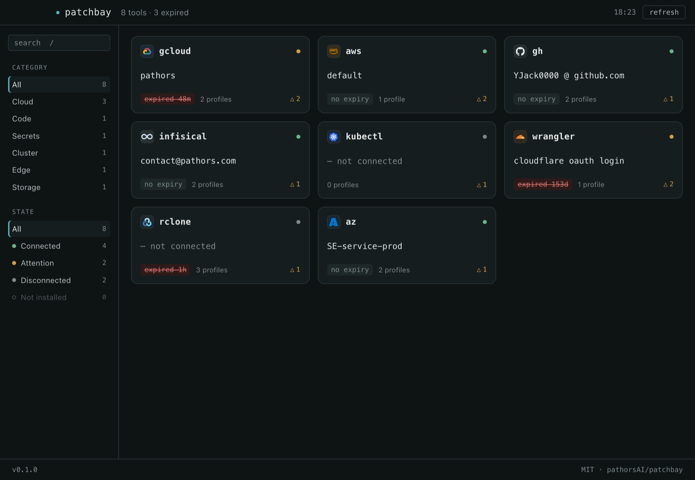
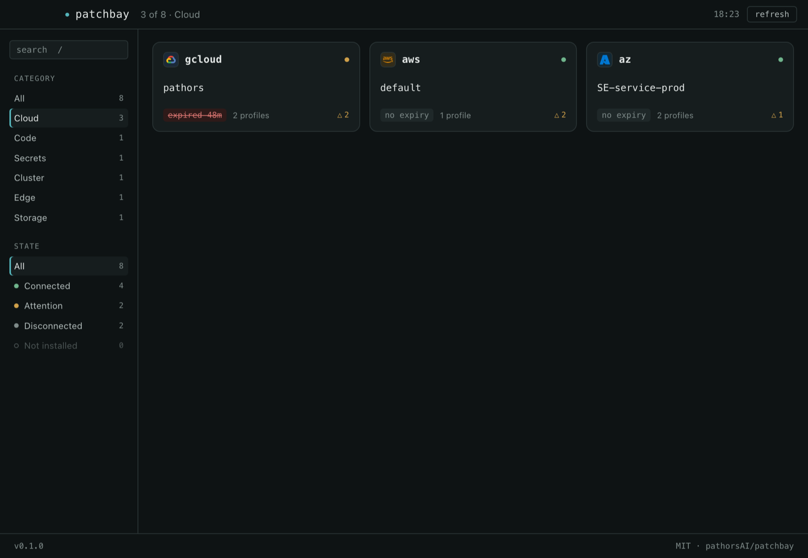
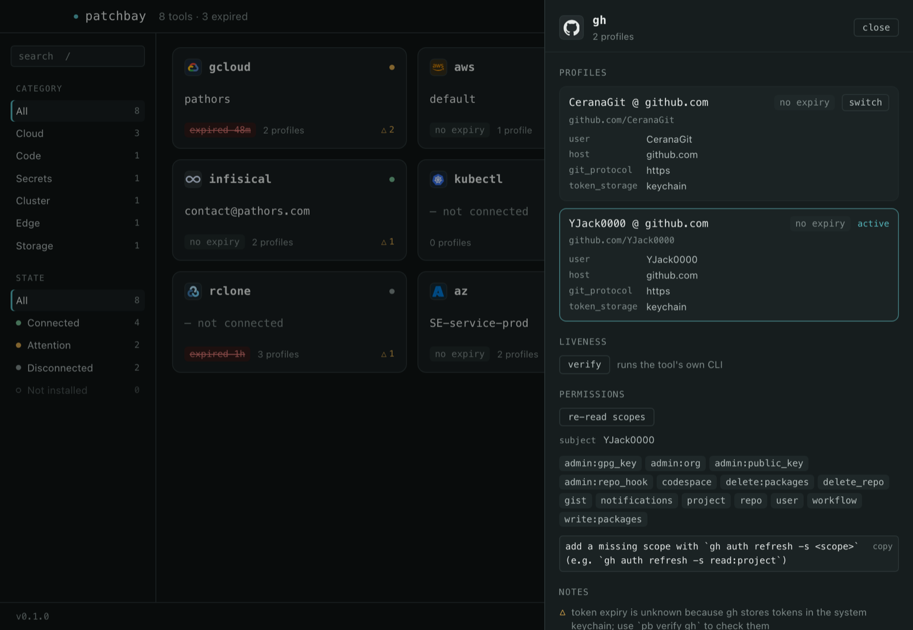

# patchbay

[](https://github.com/pathorsAI/patchbay/actions/workflows/ci.yml)
[](LICENSE)

**One panel for every CLI login on your machine — built for humans _and_ AI agents.**

`gcloud` with five accounts, `gh`, `aws`, `az`, `infisical` across two orgs, `kubectl`, `wrangler`, `rclone`… every CLI stores its auth somewhere different, expires on its own schedule, and has its own switching incantation. patchbay reads them all from local state files in milliseconds and puts the whole board in one place — a desktop panel for you, an MCP server for your AI.



## Table of contents

- [What it does](#what-it-does)
- [Install](#install)
- [Use](#use)
- [Keeping CLIs current](#keeping-clis-current)
- [Moving to a new machine](#moving-to-a-new-machine)
- [MCP — let your AI operate it](#mcp--let-your-ai-operate-it)
- [Showcase](#showcase)
- [Build from source](#build-from-source)
- [Docs](#docs)

## What it does

- **Status board** — every tool, every profile, which is active, when tokens expire. File reads only; no API calls unless you ask to `verify`.
- **Switch** — change profile/context from the panel, the CLI, or an AI — including the traps (`gcloud` ADC).
- **Permissions** — see what your tokens can actually do (`gh` scopes today) and fix missing scopes with one hint.
- **[MCP client management](docs/mcp-clients.md)** — every MCP server registered in Claude Code, Claude Desktop, Cursor, Codex, Windsurf and VS Code in one matrix; copy a server between clients without hand-editing four files in two formats.
- **[Key vault](docs/key-vault.md)** — standalone API keys no CLI tracks: values in the macOS Keychain, metadata on disk, provider-aware `pb key verify`, and AI registration over MCP.
- **[Project env vault](docs/env-vault.md)** — a project's environment variables without a plaintext `.env`: pull from Infisical, keep hand-set local overrides that never sync back, run a command with the merged result. A project is a portable name, not a path — `pb export` carries the manifest to a new machine (or copy the one file), clone the repo, pull.
- **[Keeping CLIs current](#keeping-clis-current)** — which tools are outdated, which were renamed out from under you, and the exact command to update each one.
- **[Migrate](docs/migration.md)** — export to a new machine; whatever can't travel, your AI walks you through re-authing.

## Install

macOS. From [Releases](https://github.com/pathorsAI/patchbay/releases) — all artifacts are Developer ID signed, the DMG is notarized:

```sh
# panel: download the .dmg, drag to Applications

# CLI + MCP server (Apple silicon; use x86_64-apple-darwin on Intel)
tag=v0.1.0; arch=aarch64-apple-darwin; tmp=$(mktemp -d)
curl -fsSL "https://github.com/pathorsAI/patchbay/releases/download/$tag/pb-$tag-$arch.tar.gz" | tar xz -C "$tmp"
sudo mv "$tmp/pb" /usr/local/bin/
```

## Use

```sh
pb status            # the whole board in your terminal
pb use gcloud work   # switch a profile
pb verify gh         # actually check a token against its API
pb key list          # your registered API keys
pb env run -- bun dev  # this directory's env vars, from the Keychain, no .env file
```

Or just open the panel: search with `/`, filter by category or connection state, click a card to operate that tool.

## Keeping CLIs current

Twenty-three CLIs drift. Some are versions behind, some were renamed out from under you (`neonctl` → `neon`, `huggingface-cli` → `hf`), and you find out when something breaks.

```sh
pb check-updates             # what's outdated, and the exact command to fix each one
pb check-updates --refresh   # ignore the 24h cache and re-check everything
```

```
TOOL         INSTALLED       LATEST          SOURCE         UPDATE WITH
gh           2.95.0          2.97.0          brew           brew upgrade gh
kubectl      1.32.2          1.36.3          brew           brew upgrade kubernetes-cli
neon         2.38.2          3.1.1           brew           brew upgrade neonctl
wrangler     4.105.0         4.122.0         bun            bun add -g wrangler@latest
vercel       42.2.0          58.11.0         pnpm           pnpm add -g vercel@latest
gcloud       578.0.0         —               self-managed
patchbay     0.2.0           0.3.0           github         download the DMG / curl the CLI tarball from the release page
```

**patchbay reports itself** in that table too — installed is the build answering the question, latest is the newest GitHub release — because a tool that tells you twenty-three CLIs are behind while saying nothing about itself is the one row you would have to remember to check by hand. In the panel you do not even get the command: when a newer *signed* build exists it offers `update and relaunch` in a banner above the board, verifies the signature, installs in place and restarts.

patchbay works out **how each tool was installed** and asks the right place. Every Homebrew tool is answered by a single `brew outdated --json=v2` call, npm/bun/pnpm globals by one small registry request each, and self-updating vendor CLIs (`gcloud`, `az`) by nothing at all — they get their own update command instead of a made-up version number. `latest: —` always means "could not check", never "up to date".

Results are cached at `~/.config/patchbay/versions.json` for 24 hours. **`pb status` only ever reads that cache** — it never executes a binary and never touches the network, so the board stays in the tens of milliseconds whether the cache is warm or cold. A warm cache adds an update marker to the board:

```
gh           github.com/YJack0000          2         —      ↑ 2.95.0 → 2.97.0 · token expiry unknown…
neon         default                       1         —      ⚠ advisory · ↑ 2.38.2 → 3.1.1
```

**Advisories** (`⚠`) are curated deprecation notices — renames, removals, end-of-life dates — and they show up whether or not the version cache is warm, because they are static data. Each one is gated so it only appears where it applies (the AWS CLI v1 end-of-support notice never shows on v2), carries a source URL, and `pb check-updates` exits non-zero when something is genuinely removed or unmaintained. Nothing goes in the table without vendor documentation behind it.
## Moving to a new machine

```sh
pb export                        # one encrypted .pbx: the logins that can travel
pb import patchbay-*.pbx         # --dry-run first; existing files are backed up
pb plan                          # what's left, with the exact command for each
```

Files that work anywhere get copied (`gcloud`, `aws`, `kubectl`, `wrangler`,
`rclone`, `npm`, `docker`, `ssh` config…). Credentials the OS keychain or the
device itself is holding can't, and patchbay says so instead of pretending —
each becomes one line with the command that fixes it. Your AI can work that list
over MCP (`plan_setup`, `mark_setup_done`), and patchbay re-probes after every
step rather than believing it.

The [env vault](docs/env-vault.md)'s projects ride along as metadata — ids,
environments and sync pins, so the new machine knows what to pull. No variable
value travels, in either layer, and neither does this machine's list of which
directories belong to which project.

Encrypted with a passphrase, refuses to be written into a cloud-sync folder, and
never copies a private key. **[Full details, and the per-tool portability
table →](docs/migration.md)**

## MCP — let your AI operate it

```json
{ "mcpServers": { "patchbay": { "command": "/usr/local/bin/patchbay-mcp" } } }
```

Your agent gets `list_connections`, `switch_profile`, `verify`, `get_permissions`, `store_key`, `plan_setup`, and friends — "switch to the work gcloud account and deploy" becomes one sentence, and a key your AI creates mid-task gets registered instead of rotting in a chat log. Where permissions are granted per resource rather than per credential, `get_permissions` takes a `scope` and `list_permission_scopes` says what the choices are — a Google account has no roles of its own, only roles on a project, so patchbay reads the IAM policy of the one you name. Reading secret values back is **off by default** (`PATCHBAY_ALLOW_SECRET_READ=1` to opt in).

## Showcase

| Filter the board | Operate a tool |
|---|---|
|  |  |

## Build from source

```sh
cargo test && cargo run -p patchbay-cli -- status   # Rust workspace: core, CLI, MCP
cd app && bun install && bun run tauri dev          # the panel (Tauri 2 + React)
```

## Docs

- [Moving to a new machine](docs/migration.md)
- [Key vault — security model](docs/key-vault.md)
- [Project env vault — two layers, pull-only](docs/env-vault.md)
- [MCP client management](docs/mcp-clients.md)
- [Contributing & development](CONTRIBUTING.md)
- [Changelog](CHANGELOG.md)

MIT © [Pathors AI](https://github.com/pathorsAI)
